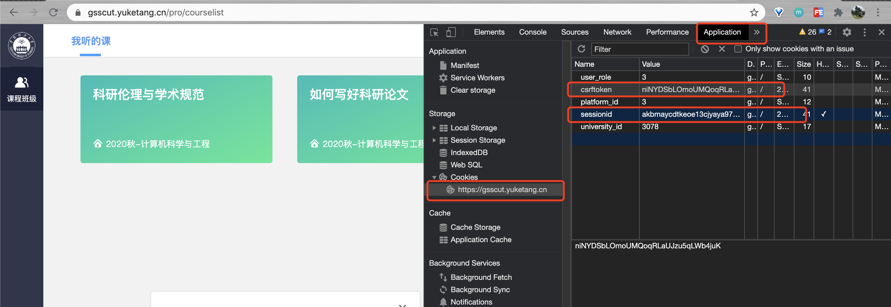

# yuketangHelper
## 华工研究生雨课堂网课脚本代码
homeworkHelper.py是雨课堂网课作业刷题自动脚本  
videoHelper.py是雨课堂网课视频观看自动脚本  
我们雨课堂的网站是：https://gsscut.yuketang.cn/pro/portal/home/  
最后更新日期：2021年10月22日  
**截止至21年01月18日，bug修复了，homeworkHelper.py已经作废**

## 须知
- 脚本假定使用者具有基本的计算机知识，懂得cookie，会按F12进入开发者模式，且会运行Python代码  
- 两个脚本都是将csrftoken和sessionid更改成自己登录后的cookie中对应的字段后即可运行

- 我知道大佬有很多，请别喷我写的代码，然后也希望一起协同完善呀！

## 跨校使用
1. 更改代码中学校的网站地址：https://xxx.yuketang.cn/....(xxx为自己学校的)
2. 根据登录后cookie里的university_id值，更改代码中university-id、university_id、uv_id  
感谢@honlu同学的测试
---

## 开发记录
### videoHelper.py
- v1、v2版本硬编码很多，几乎不能看
- v3版本能够让用户自行选择刷哪门课
- v4版本2s一个视频，1分钟十几个视频，项目管理118个视频15min刷完！快到没朋友！
- 它的优点是速度很快，油猴脚本快闪一边，但也因为太快了，视频的观看完成时间会很接近，请自己思考要不要用脚本

### SingleVideoHelper.py
- @Sue1347同学提供
- 长江雨课堂版本，在一些网址上有修改，需要自己填写一些个人信息和课程信息，目前每次只能刷一个课程

### homeworkHelper.py  
- v1、v2版本甚至无法在别人电脑上运行orz
- v3版本仅能刷项目管理概论作业题，由我独立开发
- v4版本由素未相识的李同学友情改良，可以刷用户名下所有的课程的线上作业（非常感谢杨同学和他的舍友）
- V5版本旨在跨学院使用，兼容了填空题，另外增加了交互，可以选择想刷哪个课程
- 寿终正寝啦，已经无法使用

---

## 讲点故事
> 技术大佬请绕道，谢谢

最开始产生要写脚本的想法，是在上论文写作课，我看着一堆待完成的视频头疼的要死，于是按出F12查看网页网络流动，用postman去尝试发get或post请求。虽然朋友说雨课堂应该不会有bug的，我还是继续探索了一阵子。无它，就是觉得好玩。被恶作剧一般的心理驱使着，想着要是能写出自动刷视频的脚本并帮助他人，那该有多好。

后来发现了通过调整last_point参数可以提高视频的完成率，于是有了最初videoHelper的雏形。懒癌发作磨蹭了几天才写出来，然后强行让身边的同学在我电脑上登他们的账号帮他们刷完了视频。这个视频的脚本我没敢发到群里，玩了几次后这件事渐渐被我搁置了。

12月8日的时候，同学们在班级群讨论项目管理的作业很多（65个），视频也很多（118个）。我也打开了项目管理的作业，看着超出屏幕长度的作业，一股无名怒火冲上脑袋，我按下了F12。一番探索后，我很意外地发现了bug（或者是后门），我招呼自己的舍友都来看了一遍这个愚蠢的bug，然后开始写自动完成作业的脚本。这似乎是一个很自然而然的做法。我又不会认真学项目管理，我还是学计算机的，难道我要一个一个去填吗？

12月9日凌晨，我把最初的v1作业脚本发在了班群里，但第二天我就发现v1脚本换个用户根本运行不了，我慌得要死，翘了课返回实验室抓紧完善脚本，并请了一位好友帮忙测试，直到好友告诉我脚本很"完美"，我才松了一口气，把v3版本的作业脚本发到班群中。直到现在我也不知有没有人被v1版的脚本坑了。如果有，你又恰好在看这段话，那请收下我诚挚的道歉。

我想脚本应该是有帮到大家的忙的，知道这一点，我就已经很开心了。但出乎我意料的是，就在9号晚上，杨同学毫无预兆地发出了作业脚本v4，说这是他的舍友李某某改进的。我当时刚夜跑完在走回宿舍，看着消息一路边走边笑：一个根本就不认识的朋友，帮忙改进了代码。我想这就是对代码的热爱吧。李同学有一个很重要的贡献，是发现了leaf_type字段对应视频、作业、考试等不同类型的数据，这是我所忽视掉的东西。我代码写的不好，他花时间看懂了并改进，非常的厉害。

然后我把脚本发给在微电子学院的朋友，让他们帮忙测试跨学院通用性。没曾想到他们的专业课中有填空题这种类型，原来的代码直接把我好朋友的做题页面搞崩了，服务器提示500，后来经过调查发现填空题的答案key应该是answers，其他的是answer，我直呼好家伙。于是，在12月12日，我将作业代码完善到了v5版本。我同学的壮烈牺牲促成了这一版本的出现(x)，哈哈开个玩笑，后来我带我同学来到实验室，一阵骚操作把服务器500给修复好了。

再后面不断有知情人找我拿刷视频脚本，于是懒惰如我也在一下一下的"催更"中基本完善了刷视频脚本videoHelper的v3，我很感谢这些找我拿脚本的朋友。其实说真的，有人用我写的脚本，我就已经很开心了。这一个仓库呢，也只是留作纪念而已，我不敢奢望能有多少个star，有几个人协作，能获得多少使用。

我在想，也许明天雨课堂就修复好了作业题的bug，那么homeworkHelper直接作废。

我在想，也许雨课堂明天就加强了异常访问检测，把爬虫行为检测出来封禁掉，那么videoHelper直接无效。

但起码在此时此刻，它们是有用且有帮助的。

2020.12.15 于实验室

---

2020.12.18 更新

今天突然想到可以把heart_data字段中的内容多个合并为单个json数据一齐发出去，这样就能大大提高刷课速度了！于是我根据这个idea开发了v5的视频脚本。现在没有什么视频是1个请求搞不定的（如果有，就2个请求）哈哈哈。

---

2021.01.18 更新

貌似yuketang的接口不再直接返回答案了，好日子过不久呀，homeworkHelper.py作废了。这个仓库算是我第一个真正意义上对他人有用的开源项目，以此留作纪念吧。最初我也没想过会让这个idea一步步从个人使用走到班级使用，再到跨学院使用，最后到跨校使用。不管怎样，这是很好玩的一次经历。
